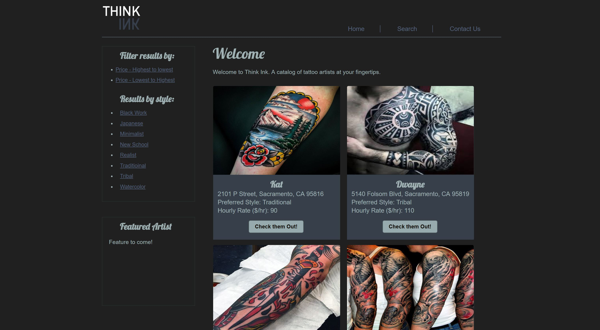
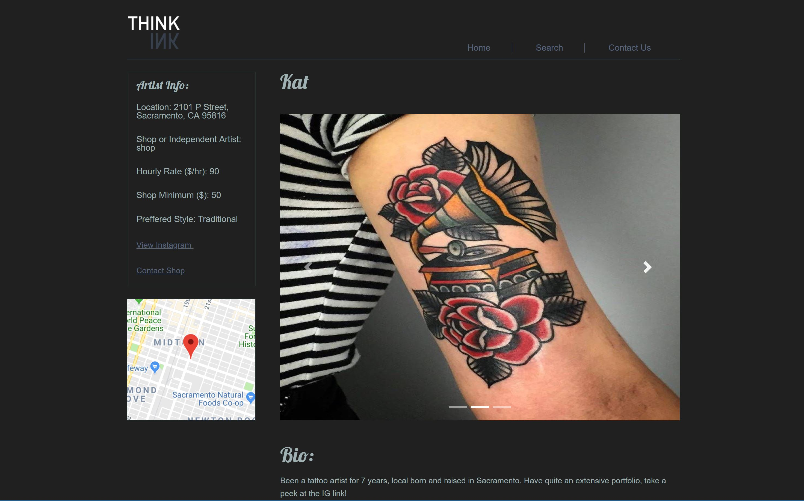

# Think-Ink

link: https://agile-lowlands-73765.herokuapp.com/

## Description

Our application offer users a tattoo artist online database at the tips of their fingers in order to help make the decision about getting tattoo easier. 

For the purposes of this app and to show its potential, we have curated a database of artists for the city of Sacramento (and only Sacramento) since the information needed is not available online. For future use, there would need to be some footwork and participation of local artists to build the database out.

## Motivation

Finding quality tattoo artists is always a pain. Whether you want to find a specific style or find an artist that fits your budget, you always have to jump through hoops and drive all over the place to finally get what you want.

Without having to leave your home you can find all the artists in your area, view their work and filter by style and price until ultimately you have found yourself the perfect match.

 
## Result

Using JavaScript, jQuery, Bootstrap, CSS, the Google geocode and maps APIs, MYSQL, JAWSDB, Sequelize, Express, Handlebars, Body Parser, Heroku and Node we were able to bring together this app. 

## Team Effort

Shannon and Kyle worked on the user interface - from conception and planning, creating templates, design, and branding. Tanner created the dummy database, worked on the Google APIs, filters and bridged the backend/frontend together via html routing. Ryan L worked on api routing, twilio, and other backend functionality. Ryan U worked on location filters, geolocation, and participated in Google APIs.

## Challenges

Location searches in our DB proved to be a difficult and organizing them based on distance to a user inputed address turned out not to be doable in the time span. Twilio, seemed easy at first, but proved to be hard to actually get working for our purposes. 

## Improvements

In the future, we can integrate a working Twilio instant contact, fb/twitter share buttons, city expansion(multiple cities) via a craigslist type method, a nearby filter (that would distribute the results nearest to your location and display x-miles away), a reviews section, a ratings Section, and an image uploader (coupled with an image db).

